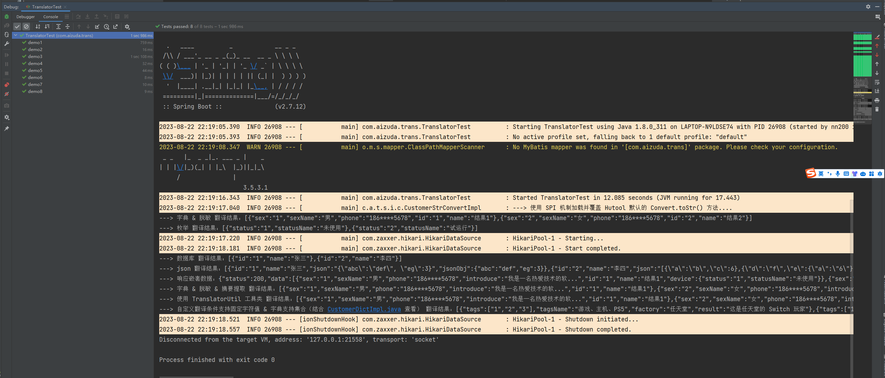

# dict-trans

## 前言

简单的字典翻译组件

## 功能

* [x] 字典翻译
* [x] 枚举翻译
* [x] 数据库翻译
* [x] 自定义翻译
* [x] 翻译结果脱敏

## 项目结构

```
EasyTranslate
 └── src
     ├── main
     │   └── java
     │       └── com
     │           └── aizuda
     │               └── trans
     │                   ├── annotation                                           翻译注解
     │                   │   ├── Dictionary.java                                  字典注解，标识在字典数据类上（自动生成查询 SQL）
     │                   │   ├── Translate.java                                   翻译字段注解，标识在需要翻译的字段上
     │                   │   └── Translator.java                                  翻译方法注解，对方法返回值进行翻译
     │                   ├── aspect
     │                   │   └── TranslateAspect.java                             翻译切面
     │                   ├── config
     │                   │   └── TranslatorConfig.java                            默认翻译方法注入配置
     │                   ├── constants                                            常量配置
     │                   │   └── DesensitizedTypeConstants.java
     │                   ├── desensitized                                         脱敏相关
     │                   │   ├── Desensitized.java
     │                   │   └── IDesensitized.java
     │                   ├── dict                                                 数据字典相关
     │                   │   └── DictTranslate.java
     │                   ├── enums                                                枚举相关
     │                   │   ├── EnumPool.java
     │                   │   ├── FormatType.java
     │                   │   └── IEnum.java
     │                   ├── service
     │                   │   ├── DictTranslateService.java                        字典翻译接口
     │                   │   ├── impl
     │                   │   │   ├── DefaultDictTranslateServiceImpl.java         默认数据字典翻译实现（实现字典翻译接口。仿照该方法，实现自己的业务）
     │                   │   │   ├── DictCacheTranslator.java                     数据字典翻译实现（调用 字典翻译接口实现）
     │                   │   │   ├── DataBaseTranslator.java                      数据库翻译服务
     │                   │   │   ├── DesensitizedTranslator.java                  脱敏实现（没啥操作，就返回原值）
     │                   │   │   ├── EnumTranslator.java                          枚举翻译实现
     │                   │   │   └── TranslatorHandle.java                        翻译操作类
     │                   │   └── Translatable.java                                翻译接口（字典、枚举、....接实现该接口）
     │                   ├── TranslatorBootApplication.java
     │                   └── util                                                 一些工具类
     │                       ├── LambdaUtil.java
     │                       └── NameUtil.java
     └── test                                                                     demo演示
```

## 快速开始

### 引入jar包

```xml
<!-- 自行编译 -->
<dependency>
    <groupId>com.aizuda</groupId>
    <artifactId>dict-trans</artifactId>
    <version>${latestVersion}</version>
</dependency>

<!-- hutool工具类 -->
<dependency>
    <groupId>cn.hutool</groupId>
    <artifactId>hutool-all</artifactId>
    <version>${hutool.version}</version>
</dependency>

<!-- 数据库 -->
<dependency>
    <groupId>com.baomidou</groupId>
    <artifactId>mybatis-plus-boot-starter</artifactId>
    <version>${mybatis-plus.version}</version>
    <optional>true</optional>
</dependency>

<dependency>
    <groupId>mysql</groupId>
    <artifactId>mysql-connector-java</artifactId>
    <optional>true</optional>
</dependency>
```

### 配置

```yaml
spring:
  datasource:
    driver-class-name: com.mysql.jdbc.Driver
    url: jdbc:mysql://127.0.0.1:3306/t_test?useUnicode=true&characterEncoding=UTF-8&serverTimezone=UTC&allowMultiQueries=true&useSSL=false&rewriteBatchedStatements=true
    username: root
    password: 123456
```

### 注解说明

#### @Dictionary

> 需配合 `@Translate` 、`@Translator` 食用

说明：标识在字典数据类上（自动生成查询 SQL），**只能用在类上**

参数：
* table：字典表名，为空时取 `TableName` ，取不到则取 类名（驼峰转大写下划线）
* codeColumn：字典编码的属性，对应 查询条件的列字段（需要的是表字段）
* textColumn：字典值的列名，对应 要查询的字段（需要的是表字段）
* groupColumn：字典组别属性，对应 要查询的字段（需要的是表字段，某些字典可能会需要根据某个类别划分，再进行翻译，如静态字典中的DICT_ID）
* translator：自定义翻译方法，遇到特殊的翻译场景可自定义翻译实现，需要自行编写实现类实现Translatable接口并实现翻译方法，程序将使用该方法进行翻译，该注解中的所有配置信息将传递到实现方法中

示例：
```java
// =========================== 示例1 ===========================
/**
 * 用户(数据库)
 *
 * @author nn200433
 * @date 2022-12-16 016 14:07:27
 */
@Dictionary(codeColumn = "id", textColumn = {"user_name"})
@TableName("sys_user")
public class UserDB {
    
    @TableId(value = "id", type = IdType.ASSIGN_UUID)
    private String id;
    
    @TableField(value = "user_name")
    private String name;

}

// =========================== 示例2 ===========================
/**
 * 人
 *
 * @author nn200433
 * @date 2022-12-16 016 11:40:30
 */
@Data
@Builder
@NoArgsConstructor
@AllArgsConstructor
public class People {
    
    @Translate(dictClass = Dict.class, groupValue = "sex", translateField = "sexName")
    private String sex;
    
    private String sexName;
    
    @Translate(dictClass = Desensitized.class, translateField = "phone", desensitizedModel = DesensitizedTypeConstants.MOBILE_PHONE)
    private String phone;
    
    @Translate(dictionary = @Dictionary(translator = CustomerTranslateServiceImpl.class), translateField = "name")
    private String id;
    
    private String name;

}
```

#### @Translate

> 需配合 `@Dictionary` 、`@Translator` 食用

说明：标识在需要翻译的字段上，**只能用在字段上**

参数：
* dictClass：字典配置类，指定的 class 上必须是 `DictTranslate.class` 实现类 、 `IEnum` 接口的实现类 、 `Desensitized` 或者是 `@Dictionary` 注解；
* translateField：翻译后的属性名，注意使用驼峰命名，默认为原属性名去除末尾的 "Id" 和 "Code" 再接上 "Name"；
* groupValue：组属性值，在静态字典表这种拥有组属性的字典中需要手动传入一个定值（即：字典分组的 code）；
* dictionary：指定 `Dictionary` 并设置其属性，将覆盖 `dictClass` 上的 `Dictionary` 注解的配置，指定了该属性后也可不指定 `dictClass` ，一般情况下不会使用；
* conditionField：指定判断条件字段（仅自定义翻译实现时用来进行判断）;
* desensitizedModel：脱敏模型，用来给数据脱敏打 `*` 使用。常见模型在 `DesensitizedTypeConstants` 常量中。也可自定义，格式：`{含开始位置,含结束位置}` ，举例：`{1,2}` ；

  *注：字段自身脱敏时，需将 `dictClass` 设置为 `Desensitized.class`（此时字段仅返回原值后脱敏。可与翻译共用，那样先翻译后脱敏。）*

* value：dictClass的别名，当只需要配置 `dictClass` 时，可以简写成 `@Translate(XX.class)` ；

示例：
```java
// =========================== 示例1 字典 ===========================

// 1.1 字典 code（需要在实现字典翻译服务时自己实现）

@Translate(dictClass = Dict.class, groupValue = "sex", translateField = "sexName")
private String sex;

private String sexName;

// 1.2 自定义完整字典（需要在实现字典翻译服务时自己实现）

@Translate(dictClass = Dict.class, groupValue = "{男:1;女:2;}", translateField = "sexName")
private String sex;

private String sexName;

// =========================== 示例2 数据库 ===========================

// 2.1. 字典定义
@Dictionary(codeColumn = "id", textColumn = {"user_name"})
@TableName("sys_user")
// 省略 @Data 等
// ....
public class UserDB {
}

// 2.2. 字段翻译
@Translate(dictClass = UserDB.class, translateField = "name")
private String id;
    
private String name;

// =========================== 示例3 枚举 ===========================

// 3.1. 枚举定义
public interface MyDict {
    /**
     * 示例1：性别枚举
     */
    enum SexDict implements IDict {
        //
        MALE("0", "男"),
        FEMALE("1", "女");

        SexDict(String code, String text) {
            // 构造方法中只需要调用接口的init方法即可，省略了属性的定义和赋值，也不用定义累赘的get方法
            init(code, text);
        }
    }
}

// 3.2. 枚举翻译
/**
 * 性别
 */
@Translate(MyDict.SexDict.class)
private String sex;

private String sexName;

// =========================== 示例4 脱敏 ===========================

// 4.1 字段给自身脱敏
@ApiModelProperty("联系电话")
@Translate(dictClass = Desensitized.class, desensitizedModel = DesensitizedTypeConstants.MOBILE_PHONE, translateField = "phone")
private String phone;

// 4.2 字段翻译并脱敏
@ApiModelProperty("用户等级")
@Translate(dictClass = Dict.class, groupValue = DictConstants.APP_USER_LEVEL, translateField = "userLevelName", desensitizedModel = "{0,1}")
private String userLevel;

@ApiModelProperty("用户等级中文")
private String userLevelName;

// =========================== 示例5 自定义 ===========================
    
// 5.1 翻译字段
@Translate(dictionary = @Dictionary(translator = CustomerTranslateServiceImpl.class), translateField = "name")
private String id;
    
private String name;

// 5.2 自定义翻译方法
@Component
public class CustomerTranslateServiceImpl implements Translatable {
    
    @Override
    public List<String> translate(String groupValue, String conditionValue, String origin, Dictionary dictConfig,
                                  Class dictClass) {
        List<String> rList = new ArrayList<String>(1);
        if (StrUtil.equals(origin, "1")) {
            rList.add("结果1");
        } else {
            rList.add("结果2");
        }
        return rList;
    }

}

// =========================== 示例6 数据库查询多字段进行字段映射 ===========================

// 6.1 数据库字典类
@Dictionary(codeColumn = "id", textColumn = {"user_name", "real_name"})
@TableName("sys_user")
// 省略 @Data 等
// ....
public class UserDB {
}


// 6.2 翻译字段
// 注意：translateField 需要跟 textColumn 的下标一一对应！！！
@Translate(dictClass = UserDB.class, translateField = {"zh", "zsxm"})
private String id;

private String zh;

private String zsxm;

```

#### @Translator

> 需配合 `@Dictionary` 、`@Translate` 食用
>
> 方法返回类型支持 `Map` 、 `Entity` 、 `List` 、 `IPage`


说明：对方法返回值进行翻译，**只能用在方法上**

参数：无

示例：

```java
@Component
public class DemoServiceImpl implements DemoService {
    
    @Translator
    @Override
    public List<People> dictDemo() {
        People man   = People.builder().sex("1").id("1").phone("18612345678").build();
        People woman = People.builder().sex("2").id("2").phone("18612345678").build();
        return CollUtil.newArrayList(man, woman);
    }
    
    @Translator
    @Override
    public List<Device> enumDemo() {
        Device man   = Device.builder().status("1").build();
        Device woman = Device.builder().status("2").build();
        return CollUtil.newArrayList(man, woman);
    }
    
    @Translator
    @Override
    public List<People2> dbDemo() {
        People2 man   = People2.builder().id("1").build();
        People2 woman = People2.builder().id("17ed02e3f05c629385371ce561f2dc50").build();
        return CollUtil.newArrayList(man, woman);
    }

}
```

## 演示

```java
@SpringBootTest
@RunWith(SpringRunner.class)
public class TranslatorTest {
    
    @Autowired
    private DemoService demoService;
    
    @Test
    public void demo1() {
        List<People> peopleList = demoService.dictDemo();
        Console.log("---> 翻译结果：{}", peopleList);
    }
    
    @Test
    public void demo2() {
        List<Device> deviceList = demoService.enumDemo();
        Console.log("---> 翻译结果：{}", deviceList);
    }
    
    @Test
    public void demo3() {
        List<People2> peopleList = demoService.dbDemo();
        Console.log("---> 翻译结果：{}", peopleList);
    }
    
}
```



## 附注

该项目得益于 [Transformer v1 版本](https://github.com/luo-zhan/Transformer) 增加了 脱敏，完善了 数据库翻译 等功能。（Transformer可能是最简单，但最强大的字段转换插件，一个注解搞定任意转换，让开发变得更加丝滑），基本上就是在此项目上增加功能。

## 特别鸣谢

> 感谢以下的项目,排名不分先后

* [Hutool](https://hutool.cn) Hutool是一个Java工具包，让Java语言也可以“甜甜的”。
* [MyBatis-Plus](https://baomidou.com/) MyBatis-Plus (opens new window)（简称 MP）是一个 MyBatis (opens new window)的增强工具，在 MyBatis 的基础上只做增强不做改变，为简化开发、提高效率而生。